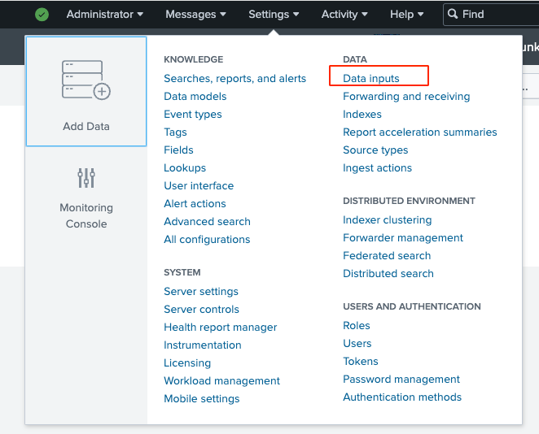

# Swit Add-on for Splunk

## Install

1. Open the Splunk web interface, and move to **Manage Apps**.
2. In the top right corner are two install options:
   - **Browse more apps**: Use this option to install the app from Splunkbase.
   - **Install app from file**: Use this option to install the app from a file.

## Configuration & use
1. In the **Apps** list, locate **Swit Add-on for Splunk** and click on **Launch app**.
2. Select the **Configuration** tab.
3. Get a refresh token and save it.
4. From the **Settings** menu, click on **Data inputs**.

   

5. In the **Local inputs** list, find and click on **Swit Adit Logs**.
6. Click on **New** in the top right corner, and register one following the instructions.
7. Now, you can search for the data in the **Search** tab.